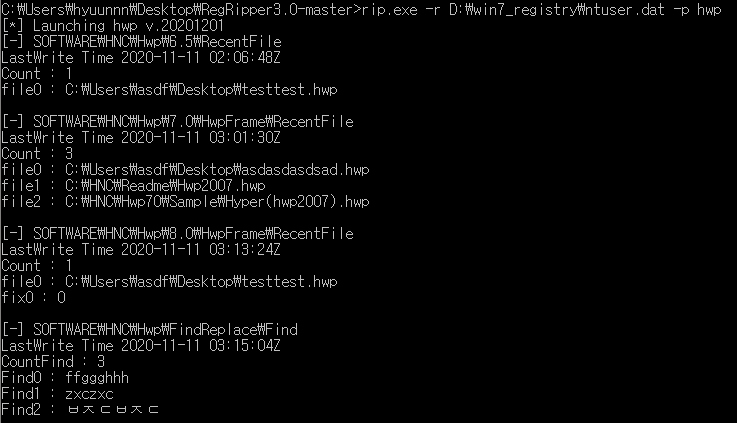
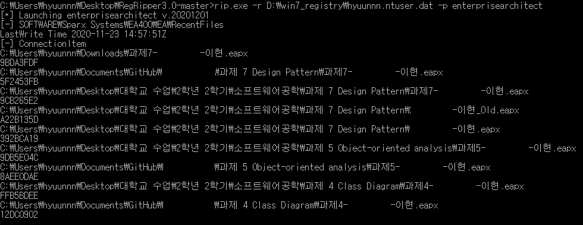

## RegRipper_Plugins


### Usage
```
rip.exe -r D:\win7_registry\ntuser.dat -p hwp
rip.exe -r D:\win7_registry\ntuser.dat -p bandizip
rip.exe -r D:\win7_registry\ntuser.dat -p enterprise_architect
rip.exe -r D:\win7_registry\ntuser.dat -f korea_software
```


